# Architecture

> Why this template is structured the way it is — the design decisions behind every directory, convention, and pattern.

## The Core Problem

AI coding agents work best when they have rich, accurate context about your project. But each agent reads context from different files in different formats:

- Claude Code reads `CLAUDE.md` and `.claude/`
- GitHub Copilot reads `.github/copilot-instructions.md`
- Jules reads `AGENTS.md`
- Antigravity reads `GEMINI.md` and `.agent/`
- Kilo Code reads `AGENTS.md` and `.kilocode/rules/`
- Cursor / Codex read `AGENTS.md`

Without a template, developers either configure one tool well (and others poorly), or duplicate content across files that inevitably drift out of sync.

This template solves that with a **multi-layered, zero-duplication architecture**: one source of truth per concern, delivered in every agent's native format.

---

## Layered Instruction Architecture

```mermaid
flowchart TB
    AGENTS["📄 AGENTS.md\nUniversal context — always on\nProject overview · architecture · coding rules"]

    AGENTS --> CLAUDE["📄 CLAUDE.md\nClaude Code only\nConstraints · prohibitions · context hooks"]
    AGENTS --> COPILOT["📄 .github/copilot-instructions.md\nGitHub Copilot only\nAlways-on rules · prompt files"]
    AGENTS --> KILO["📄 .kilocode/rules/\nKilo Code only\nPriority 2 — overrides AGENTS.md"]
    AGENTS --> AGENT["📁 .agent/rules/ + GEMINI.md\nAntigravity / Gemini only\nAlways-on rules"]

    CLAUDE --> RULES["📁 .claude/rules/*.md\nPath-scoped — auto-loaded per file type\nStack-specific conventions"]

    RULES --> SKILLS["📁 Skills\n.claude/skills/ · .agents/skills/ · .agent/skills/\nOn-demand deep workflows — invoked explicitly"]
    COPILOT --> SKILLS
    KILO --> SKILLS
    AGENT --> SKILLS
```



**Key principle:** Lower layers override higher layers, but only when invoked. Path-scoped rules override AGENTS.md for specific file types. Skills override everything when active — but only for the duration of the invoked task.

---

## Directory Map

### Which agent reads which file

```mermaid
flowchart LR
    subgraph Universal
        AGENTS["AGENTS.md"]
        README["README.md"]
    end

    subgraph Claude
        CLAUDE["CLAUDE.md"]
        CRULES[".claude/rules/*.md"]
        CSKILLS[".claude/skills/"]
        CAGENTS[".claude/agents/"]
    end

    subgraph Copilot
        GH[".github/copilot-instructions.md"]
        PROMPTS[".github/prompts/"]
        INSTR[".github/instructions/"]
    end

    subgraph Kilo
        KILO[".kilocode/rules/"]
    end

    subgraph Antigravity["Antigravity / Gemini"]
        GEMINI["GEMINI.md"]
        ARULES[".agent/rules/"]
        AWFLOWS[".agent/workflows/"]
        ASKILLS[".agent/skills/"]
    end

    subgraph JulesAI["Google Jules"]
        J_AGENTS["AGENTS.md ✓"]
        J_README["README.md ✓ fallback"]
    end

    AGENTS --> Claude
    AGENTS --> Copilot
    AGENTS --> Kilo
    AGENTS --> JulesAI
    README --> JulesAI
```



### Root instruction files

| File | Read by | Purpose |
| --- | --- | --- |
| `CLAUDE.md` | Claude Code | Primary instructions: project overview, constraints, prohibited actions, test command |
| `AGENTS.md` | Jules (native), Copilot, Cursor, Codex, Kilo | Universal context: architecture, file structure, coding rules, common tasks |

These are the two most important files. Everything else extends them.

---

### `.claude/` — Claude Code exclusive

```text
.claude/
├── rules/                    ← Path-scoped: auto-loaded based on file type
│   ├── coding-standards.md   ← Applied to all files
│   └── markdown-quality.md   ← Applied to *.md files
├── agents/
│   └── qa-reviewer.md        ← Subagent definition for code review dispatch
└── skills/                   ← Claude skill library
    └── <skill-name>/
        └── SKILL.md
```

**Why path-scoped rules?** Claude Code supports loading different rules for different file types. `markdown-quality.md` only fires when Claude is editing `.md` files — it doesn't pollute the context window when editing Python or TypeScript. This keeps per-file context tight and relevant.

**Why a subagent?** The `qa-reviewer` subagent allows the `/requesting-code-review` skill to dispatch a separate Claude instance focused only on review — with no memory of the implementation decisions that led to the code. This mimics how real peer review works: fresh eyes.

---

### `.github/` — GitHub Copilot exclusive

```text
.github/
├── copilot-instructions.md   ← Persistent instructions for every Copilot Chat session
├── prompts/
│   ├── new-feature.prompt.md     ← /new-feature command
│   └── review-changes.prompt.md  ← /review-changes command
├── instructions/
│   ├── docs.instructions.md      ← Scoped to docs/**/*.md
│   └── qa-audit.instructions.md  ← Scoped to audit output files
├── ISSUE_TEMPLATE/
└── pull_request_template.md
```

**Why separate from AGENTS.md?** Copilot reads both, but `copilot-instructions.md` supports Copilot-specific features (prompt files, scoped instructions) that other agents don't understand. The content that matters for all agents lives in `AGENTS.md`; Copilot-specific features live here.

---

### `.agents/` — Universal skill directory

```text
.agents/
└── skills/            ← Works with: Copilot, Codex, Cursor, Kilo Code
    └── <skill-name>/
        └── SKILL.md
```

This directory follows the [Agent Skills Open Standard](https://agentskills.io/) — an open format for reusable AI skills that works across tools. It's the "universal" skill installation path.

---

### `.agent/` — Antigravity / Gemini exclusive

```text
.agent/
├── rules/             ← Always-on coding standards (Antigravity)
├── workflows/         ← Reusable task procedures
├── skills/            ← Antigravity skill library (same skills, Antigravity path)
└── scripts/           ← Jules API helpers, PR automation scripts
```

**Why does `.agent/` duplicate `.agents/`?** Antigravity uses `.agent/` as its skill path; most other tools use `.agents/`. The content of the skill files is identical — the duplication is purely a path-compatibility requirement. The `/skill-creator` skill includes commands to keep them in sync.

**Why are workflows separate from skills?** Workflows are linear procedures — "do step 1, then step 2, then step 3." Skills are more flexible: they provide guidance and let the agent adapt. Complex multi-step tasks like feature delivery or release readiness benefit from explicit procedural workflows. Simpler exploratory tasks like brainstorming or debugging benefit from skill-based guidance.

---

### `.kilocode/` — Kilo Code exclusive

```text
.kilocode/
└── rules/
    └── coding-standards.md   ← Priority 2 — overrides AGENTS.md
```

Kilo Code uses a priority system: `.kilocode/rules/` loads at priority 2, above `AGENTS.md` (priority 3). This means project-specific Kilo rules can override the universal AGENTS.md context when they conflict.

---

## The `[FILL: ...]` Convention

Every project-specific value in this template is marked `[FILL: description]`. This serves three purposes:

1. **Discoverability** — `grep -rn "\[FILL:" .` finds every unset value instantly
2. **Safety** — `[FILL:]` markers are inert strings that won't accidentally trigger agent behavior
3. **Documentation** — the marker text explains *what* should go there, not just that something is missing

After setup, no `[FILL:]` markers should remain.

---

## The Skills-as-Code Philosophy

Complex engineering processes — audits, feature delivery, debugging workflows — are easy to describe in English but hard for agents to execute consistently without structure.

Skills codify these processes as invocable, version-controlled procedures. Benefits:

- **Repeatability** — the same workflow every time, not whatever the agent improvises
- **Reviewability** — workflows live in git, can be code-reviewed and improved
- **Evolution** — as you learn what works for your project, you improve the skill
- **Portability** — skills follow the Agent Skills Open Standard and work across agents

The separation between "universal" skills (brainstorming, debugging) and "project-specific" skills (qa-audit, feature-delivery) reflects a real engineering distinction: some workflows are universally applicable, others need project context to be useful.

---

## Documentation Drift Prevention

A template that documents best practices while drifting from its own state is worse than no documentation — it actively misleads agents.

The architecture addresses drift at three levels:

1. **`[FILL:]` markers** — unfilled values are visible and grep-able
2. **`/doc-audit` skill** — actively scans for inconsistencies between docs and code
3. **`/release-readiness` skill** — enforces doc-sync as a release gate

---

## Optional Local Quality Tools

The template ships a `scripts/` directory with optional tools for adopters who want automated consistency checks during setup. These are **local utilities, not CI requirements** — they are most useful to run during initial customization, not as ongoing CI gates on the template itself.

### `scripts/` — adoption toolbox

```text
scripts/
├── check-fill-markers.sh        ← Scan for [FILL:] markers against an optional baseline file
│                                   Useful for adopted repos to guard against placeholder regressions
├── check-agent-context-sync.py  ← When project-context.json exists, verify its values
│                                   appear in AGENTS.md, CLAUDE.md, GEMINI.md, and
│                                   .github/copilot-instructions.md
├── template-health-report.py    ← Generates docs/TEMPLATE-HEALTH.md with live metrics
│                                   (placeholder counts, skill counts, workflow counts)
└── check-all.sh                 ← Run all available checks in one command
```

Run the full local check at any time:

```bash
bash scripts/check-all.sh
```

### `project-context.example.json` — canonical project metadata (optional)

Copy to `project-context.json` and fill in real values. Once the file exists, `check-agent-context-sync.py` verifies that `project_name`, `description`, `tech_stack`, and the `test` command all appear in the four main agent instruction files. When `project-context.json` is absent the check skips silently (template mode).

### CI workflow

`.github/workflows/pr-checks.yml` runs on every PR against `main` or `develop`:

| Job | What it checks |
| --- | --- |
| `secret-scan` | Gitleaks secret detection |
| `script-analysis` | ShellCheck on all `.sh` files |
| `pr-analysis` | AI-assisted PR review (requires `JULES_API_KEY` secret) |

Template-specific checks (placeholder counts, health report freshness) are **not** run in CI by design. The template intentionally ships with `[FILL:]` placeholders — enforcing their absence would make the template's own CI fail on every PR. These checks belong in *adopted* repos, not in the template itself.

---

## What This Template Does NOT Include

Intentional omissions:

| Not included | Why |
| --- | --- |
| Build system / bundler | Template is framework-agnostic |
| Application CI/CD pipeline | Highly project-specific; add your own deploy/build workflows |
| Test framework config | Depends on your stack |
| `package.json` / `requirements.txt` | No runtime dependencies — agent config files only |
| Pre-filled `CHANGELOG.md` | Your project's changelog belongs in your project |

The template is a **starting point**, not a complete application. Add project-specific infrastructure on top of it.
