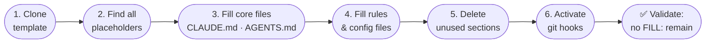

# Customization Guide

> How to turn this template into a fully configured AI coding setup for your specific project.
> Time required: 15–30 minutes for a typical project.

## Overview

Every customization point in this template is marked with a `[FILL: ...]` placeholder. The goal is to replace every placeholder with real project content — and delete sections that don't apply.



```bash
# Find all placeholders in one command:
grep -rn "\[FILL:" . --include="*.md" | grep -v node_modules
```

---

## File-by-File Guide

### 1. `CLAUDE.md` — Claude Code instructions

This is the primary context file for Claude Code. It's loaded on every conversation.

**What to fill:**

```markdown
## Project

[FILL: Project name] — [FILL: 1-sentence description].
```

**Good example:**

```markdown
## Project

Inventory API — A REST API for warehouse stock management. TypeScript, Express, PostgreSQL.
```

**Bad example (too vague):**

```markdown
## Project

My app — A web application.
```

**Critical Constraints section** — This is where you encode things Claude cannot infer from reading the code:

| Good constraint | Bad constraint |
| --- | --- |
| "No runtime npm dependencies — stdlib only" | "Write good code" |
| "All DB queries must go through `src/db/query.ts`" | "Use the database correctly" |
| "Never modify `schema.sql` directly — use migrations" | "Be careful with the database" |

**Do NOT section** — Hard prohibitions. Be specific:

```markdown
## Do NOT

- Use `eval()` or `Function()` constructor anywhere
- Commit directly to `main` — always use a PR
- Add fields to the User table without a migration
```

**After Every Change** — Fill in your real test command:

```markdown
## After Every Change

1. Run `npm test`
2. Run `npm run lint`
3. Commit via `git commit` with format `type(scope): description`
```

---

### 2. `AGENTS.md` — Universal context for all other agents

This file is read by Jules (natively), Cursor, OpenAI Codex, Kilo Code, and GitHub Copilot. Keep it factual and architectural — not a list of preferences.

**Project Overview** — Be concrete:

```markdown
## Project Overview

**Inventory API** — REST API for real-time warehouse stock management.
Used by warehouse staff via a React dashboard and by third-party logistics providers via API.
```

**Architecture section** — Only include constraints agents cannot infer from code:

```markdown
## Architecture (Must-Know)

- **No ORM** — All DB access via raw SQL in `src/db/`. Never use Prisma or Sequelize.
- **Config-driven feature flags** — All feature toggles in `config/features.ts`, never inline conditionals.
- **Read replicas** — SELECT queries must use `db.replica`, writes use `db.primary`.
```

**File Structure** — Only include files/folders agents need to know to navigate effectively. Skip obvious ones:

```markdown
## File Structure

src/
  api/routes/        ← Route handlers (thin — delegate to services)
  services/          ← Business logic (thick)
  db/                ← All DB queries (raw SQL, no ORM)
  config/
    features.ts      ← Feature flags (READ BEFORE adding conditionals)

migrations/          ← Database migrations (run via: npm run migrate)
tests/
  unit/              ← Fast, no DB
  integration/       ← Requires DB (use: npm run test:integration)
```

**Immutable Contract section** — If you have IDs, API versions, or stored values that can never change:

```markdown
## Immutable Contract — NEVER CHANGE

- `SCHEMA_VERSION=4` — written to all stored records, changing breaks existing data
- Route `/api/v1/` — used by third-party integrations, must never be removed
```

If you have nothing immutable: **delete this section entirely**.

---

### 3. `.github/copilot-instructions.md` — GitHub Copilot

This is loaded for every Copilot Chat conversation in VS Code. Keep it focused on rules, not prose:

```markdown
## Always Do

- Use the `Result<T, E>` type for all error-returning functions
- Add JSDoc to all exported functions
- Use `src/db/query.ts` for all database access

## Never Do

- Use `any` type in TypeScript
- Write business logic in route handlers
- Import directly from `node_modules` internals
```

---

### 4. `.claude/rules/coding-standards.md` — Claude path-scoped rules

This file is auto-loaded by Claude Code for **all files**. Add your stack-specific conventions:

```markdown
## TypeScript Conventions

- Prefer `interface` over `type` for object shapes
- Use `readonly` arrays where mutation is not needed
- Explicit return types on all exported functions

## Testing Conventions

- Test file naming: `*.test.ts` co-located with source
- Mock DB via `tests/helpers/db-mock.ts`, never the real DB in unit tests
```

---

### 5. `.agent/rules/coding-standards.md` — Gemini/Antigravity rules

Same content as `.claude/rules/coding-standards.md` — keep them in sync. This file is read by Google Antigravity.

---

### 6. `.kilocode/rules/coding-standards.md` — Kilo Code rules

Kilo Code loads this at priority 2 (higher than `AGENTS.md`). Use it for rules you want to override AGENTS.md:

```markdown
## Kilo Code Specifics

- Always prefer Kilo's inline diffs for reviews
- Run `npm test` before confirming any code change
```

---

### 7. Git hooks (`.githooks/`)

The pre-commit and commit-msg hooks are already wired. Activate them once:

```bash
git config core.hooksPath .githooks
chmod +x .githooks/pre-commit .githooks/commit-msg
```

Customize the pre-commit checks for your project by editing `.githooks/pre-commit`.

---

## Sections to Delete

These sections exist in the template for projects that need them. **Delete them if they don't apply to yours** — dead instructions confuse agents:

| Section | Delete if... |
| --- | --- |
| `## Immutable Contract` in AGENTS.md | No IDs or versions are externally bound |
| `## Layout Constraints` | Not a UI/mobile project |
| `## Provider-specific` language rules | Not a multi-language/multi-locale project |
| `## Database` patterns | No database in project |

---

## Validation Checklist

After filling in all placeholders, use the optional local quality checks:

```bash
# List all files that still have placeholders
grep -rln "\[FILL:" . --include="*.md" | grep -v node_modules

# Count total remaining placeholders
grep -roh "\[FILL:" . --include="*.md" | wc -l

# Verify git hooks are active
git config core.hooksPath
# Should output: .githooks
```

Or run the bundled script that combines all checks:

```bash
bash scripts/check-all.sh
```

This runs in sequence:

1. **Fill-marker check** — if a `.fill-marker-baseline` exists in your repo, verifies no tracked file exceeds its baseline count (skipped if no baseline)
2. **Context sync** — if `project-context.json` exists, verifies its values appear in all agent instruction files
3. **Health report freshness** — verifies `docs/TEMPLATE-HEALTH.md` reflects the current state

And manually verify:
- [ ] `CLAUDE.md` describes your actual project, not the template
- [ ] `AGENTS.md` architecture section is accurate for your codebase
- [ ] Test command in "After Every Change" actually runs and passes
- [ ] `Immutable Contract` section either has real values or is deleted
- [ ] `.env` is in `.gitignore` (it is by default — don't remove it)

### Optional: canonical project metadata

For automated cross-file consistency checking, copy the example context file and fill it in:

```bash
cp project-context.example.json project-context.json
# Edit project-context.json with your real project_name, description, tech_stack, and commands
```

Once `project-context.json` exists, `bash scripts/check-all.sh` will also verify that these values are present in `AGENTS.md`, `CLAUDE.md`, `GEMINI.md`, and `.github/copilot-instructions.md`. This catches drift when one file is updated but the others are not.
