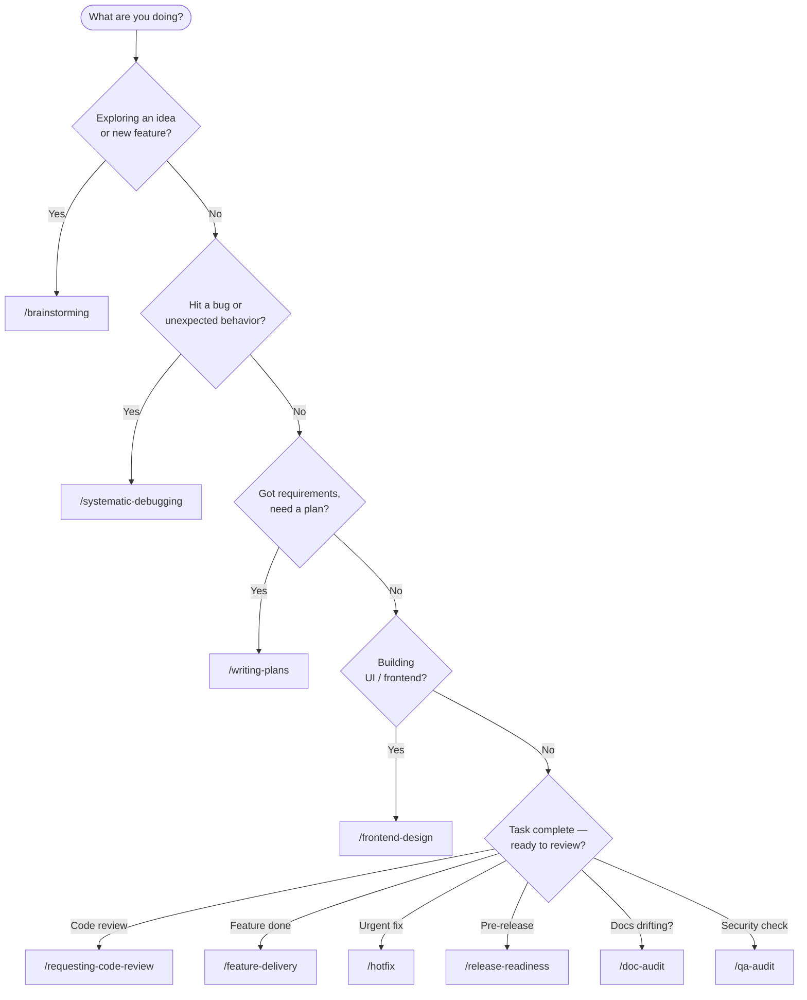

# Skills Catalog

> All pre-built skills included in this template — what they do, how to invoke them, and which agents support them.

## How Skills Work

Skills are invocable AI workflows. You call them by name in your agent's chat interface and the agent follows the skill's procedure — no extra setup required.

**Not sure which skill to use?**



| Agent | How to invoke |
| --- | --- |
| **Claude Code** | `/skill-name` in chat |
| **GitHub Copilot** | `@workspace /skill-name` or reference in prompt |
| **Cursor** | Mention skill name in chat |
| **Kilo Code** | `/skill-name` in chat |
| **Antigravity / Gemini** | Mention skill name; agent auto-discovers from `.agent/skills/` |

Skills live in three parallel directories (same content, different paths for agent compatibility):

- `.claude/skills/` — Claude Code
- `.agents/skills/` — Universal (Copilot, Codex, Cursor, Kilo Code)
- `.agent/skills/` — Antigravity / Gemini

### Source legend

Each skill entry is tagged with its origin:

| Tag | Source |
| --- | --- |
| `[obra/superpowers]` | [github.com/obra/superpowers](https://github.com/obra/superpowers) — by Jesse Vincent (@obra) |
| `[skills.sh]` | [skills.sh](https://skills.sh) marketplace — third-party verified skill |
| `[this template]` | Created for this template — contains `[FILL:]` markers for your project |

---

### Installing skills from skills.sh

Browse skills at **[skills.sh](https://skills.sh)**, then install in three steps:

**1. Find the skill URL** on skills.sh (each skill has a raw SKILL.md link).

**2. Install into all three directories:**

```bash
SKILL=my-skill-name
SKILL_URL=https://skills.sh/skills/my-skill-name/SKILL.md

mkdir -p .claude/skills/$SKILL .agents/skills/$SKILL .agent/skills/$SKILL
curl -sL "$SKILL_URL" -o .claude/skills/$SKILL/SKILL.md
cp .claude/skills/$SKILL/SKILL.md .agents/skills/$SKILL/SKILL.md
cp .claude/skills/$SKILL/SKILL.md .agent/skills/$SKILL/SKILL.md
```

**3. Verify:**

```bash
ls .claude/skills/$SKILL/SKILL.md   # should exist
```

The skill is immediately available — no restart needed. Invoke it in your agent with `/my-skill-name`.

**Installing the full obra/superpowers suite** (recommended):

```bash
git clone https://github.com/obra/superpowers /tmp/superpowers
for dir in .claude/skills .agents/skills .agent/skills; do
  cp -r /tmp/superpowers/skills/* "$dir/"
done
```

---

## Setup Skill

---

### `setup-repo` `[this template]`

**Run immediately after cloning** — analyze the codebase and auto-generate filled versions of every agent instruction file.

Reads package.json, config files, git hooks, CI config, and source structure to infer project name, tech stack, constraints, prohibitions, test commands, and file structure. Outputs ready-to-paste content for all 8 instruction files, replacing every `[FILL:]` marker.

**Works without any manual input** — the agent derives everything from the codebase itself.

**For non-Claude Code agents:** run `npx repomix` first to bundle the repo, then attach the output.

| | |
| --- | --- |
| **Invoke** | `/setup-repo` |
| **When** | Immediately after cloning; when manual fills aren't deep enough |
| **When NOT** | Repo already fully set up (no `[FILL:]` markers remain) |
| **Needs `[FILL:]`** | No |
| **Agents** | All |
| **Copilot** | `/setup-repo` prompt in `.github/prompts/setup-repo.prompt.md` |

---

## Universal Skills

These skills need no project customization. Use them as-is.

---

### `brainstorming` `[this template]`

**Use before any creative work** — features, components, UI changes, new functionality.

Explores user intent, design constraints, and edge cases through structured dialogue before writing a single line of code. Prevents building the wrong thing.

| | |
| --- | --- |
| **Invoke** | `/brainstorming` |
| **When** | Before implementing anything non-trivial |
| **When NOT** | For trivial one-liner fixes or purely mechanical tasks |
| **Needs `[FILL:]`** | No |
| **Agents** | All |

---

### `systematic-debugging` `[obra/superpowers]`

**Use before proposing any fix** to a bug, test failure, or unexpected behavior.

Enforces root-cause tracing instead of guessing. Follows a structured investigation: reproduce → isolate → hypothesize → verify → fix. Resists pressure to jump to conclusions.

| | |
| --- | --- |
| **Invoke** | `/systematic-debugging` |
| **When** | Any bug, failing test, or "why is this broken?" question |
| **When NOT** | When you already know the root cause with certainty |
| **Needs `[FILL:]`** | No |
| **Agents** | All |

---

### `writing-plans` `[this template]`

**Use when you have requirements** for a multi-step task, before touching code.

Produces a detailed implementation plan: which files to touch, in what order, how to test each step, and what to verify. Generates bite-sized tasks. Assumes zero context from the engineer reading it.

| | |
| --- | --- |
| **Invoke** | `/writing-plans` |
| **When** | Before starting any multi-step feature or refactor |
| **When NOT** | Single-file changes that fit in one prompt |
| **Needs `[FILL:]`** | No |
| **Agents** | All |

---

### `requesting-code-review` `[this template]`

**Use after completing a task** or before merging, to catch issues early.

Dispatches a `qa-reviewer` subagent (Claude) that reviews your changes against the project's rules and surfaces violations before they become problems.

| | |
| --- | --- |
| **Invoke** | `/requesting-code-review` |
| **When** | After implementing a feature, before creating a PR |
| **When NOT** | During development — wait until a logical checkpoint |
| **Needs `[FILL:]`** | No |
| **Agents** | Claude Code (subagent dispatch), others (inline review) |

---

### `skill-creator` `[skills.sh]`

**Use when you want to add a new skill** to the library or update an existing one.

Guides you through the skill format, frontmatter conventions, workflow structure patterns, and cross-agent compatibility requirements.

| | |
| --- | --- |
| **Invoke** | `/skill-creator` |
| **When** | Creating or updating a skill |
| **When NOT** | When editing regular project files |
| **Needs `[FILL:]`** | No |
| **Agents** | All |

---

### `find-skills` `[obra/superpowers]`

**Use when you want to discover skills** from the open agent skills ecosystem.

Helps you find skills that might exist for your task — both in this repo and from the broader community. Covers installation and integration.

| | |
| --- | --- |
| **Invoke** | `/find-skills` |
| **When** | "Is there a skill for X?", "How do I do Y with an agent?" |
| **When NOT** | When you know exactly what you need |
| **Needs `[FILL:]`** | No |
| **Agents** | All |

---

### `using-superpowers` `[obra/superpowers]`

**Meta-skill** — establishes the rule that skills must be invoked before responding to any request where they apply. Activates at conversation start to prime the agent.

| | |
| --- | --- |
| **Invoke** | `/using-superpowers` (or load at start of session) |
| **When** | Start of any session where you want maximum skill usage |
| **Needs `[FILL:]`** | No |
| **Agents** | All |

---

### `frontend-design` `[skills.sh]`

**Use when building UI** — web components, pages, dashboards, HTML/CSS layouts, React components.

Generates production-grade frontend code with strong aesthetic judgment. Deliberately avoids generic "AI slop" patterns. Prioritizes visual distinctiveness and working code over boilerplate.

| | |
| --- | --- |
| **Invoke** | `/frontend-design` |
| **When** | Any UI/frontend task |
| **When NOT** | Backend, config, or infrastructure tasks |
| **Needs `[FILL:]`** | No |
| **Agents** | All |

---

### `jules-tasks` `[this template]`

**Use to audit and manage Jules AI sessions.**

Lists active Jules sessions, reviews their status, and helps batch-manage tasks delegated to Jules.

| | |
| --- | --- |
| **Invoke** | `/jules-tasks` |
| **When** | Reviewing Jules batch work, checking session status |
| **Needs `[FILL:]`** | Requires `JULES_API_KEY` in `.env` |
| **Agents** | Claude Code, Antigravity |

---

## Project-Specific Skills `[this template]`

These skills contain `[FILL:]` markers. Fill them in for your project before using.

---

### `qa-audit` `[this template]`

**9-phase security and robustness audit** of your codebase.

Covers: XSS/injection scanning, rule compliance verification, race condition analysis, config schema validation, and documentation drift detection. Produces a severity-classified report (Critical / High / Medium / Low).

| | |
| --- | --- |
| **Invoke** | `/qa-audit` |
| **When** | Before releases, after large refactors, when reviewing security posture |
| **Needs `[FILL:]`** | Yes — project-specific scan patterns in SKILL.md |
| **Agents** | All (`allowed-tools` restricted to read/grep for safety) |

---

### `doc-audit` `[this template]`

**8-phase documentation drift audit** across all docs, agent instructions, and config files.

Checks that every count, path, file reference, and config field in documentation matches the actual codebase. Surfaces stale docs, broken links, and inconsistencies.

| | |
| --- | --- |
| **Invoke** | `/doc-audit` |
| **When** | After adding/removing files, before releases, when docs feel out of date |
| **Needs `[FILL:]`** | Yes — file paths and expected counts for your project |
| **Agents** | All (`disable-model-invocation: true` — deterministic scan only) |

---

### `feature-delivery` `[this template]`

**End-to-end feature workflow**: planning → implementation → QA → docs sync.

Follows `.agent/workflows/feature-delivery.md` strictly. Ensures every feature goes through the full delivery checklist: design, implementation, tests, documentation update, and review.

| | |
| --- | --- |
| **Invoke** | `/feature-delivery` |
| **When** | Delivering a new feature or larger enhancement |
| **When NOT** | Small bug fixes (use `/hotfix` instead) |
| **Needs `[FILL:]`** | Yes — workflow file has project-specific steps |
| **Agents** | All |

---

### `hotfix` `[this template]`

**Fast but controlled workflow for urgent production fixes.**

Prioritizes speed while maintaining safety: targeted scope, mandatory test verification, no scope creep. Follows `.agent/workflows/hotfix.md`.

| | |
| --- | --- |
| **Invoke** | `/hotfix` |
| **When** | Critical bug in production that needs an immediate fix |
| **When NOT** | Non-urgent issues — use `/feature-delivery` |
| **Needs `[FILL:]`** | Yes — deployment/rollback steps in workflow file |
| **Agents** | All |

---

### `release-readiness` `[this template]`

**Pre-release quality gate**: functional checks, baseline validation, documentation integrity.

Runs through a checklist of everything that must be true before tagging a release: tests pass, docs are synced, no outstanding `[FILL:]` markers, CHANGELOG is updated.

| | |
| --- | --- |
| **Invoke** | `/release-readiness` |
| **When** | Before publishing a new version or tagging a release |
| **Needs `[FILL:]`** | Yes — release checklist items for your project |
| **Agents** | All |

---

### `architecture-change` `[this template]`

**Controlled workflow for structural/architectural changes** with mandatory ADR.

Requires writing an Architecture Decision Record (ADR) before implementing. Enforces controlled rollout, documentation update, and risk assessment.

| | |
| --- | --- |
| **Invoke** | `/architecture-change` |
| **When** | Any change that affects the system's structure, data flow, or core dependencies |
| **When NOT** | Feature additions that don't change architecture |
| **Needs `[FILL:]`** | Yes — ADR template and review process in workflow file |
| **Agents** | All |

---

## Prompt Files (GitHub Copilot)
These are Copilot-specific prompt files triggered with `/command` in VS Code Copilot Chat:

| Prompt | Invoke | What it does |
| --- | --- | --- |
| `new-feature.prompt.md` | `/new-feature` | Structured feature planning — explores requirements before implementation |
| `review-changes.prompt.md` | `/review-changes` | Pre-commit rule compliance check — catches violations before committing |

Prompt files live in `.github/prompts/`.

---

## Adding New Skills

Use the `/skill-creator` skill to guide creation. The format is:

```text
.claude/skills/my-skill/
    SKILL.md          ← Required: frontmatter + instructions
    references/       ← Optional: supporting docs
```

Copy to all three skill directories to make it available across agents:

```bash
cp -r .claude/skills/my-skill .agents/skills/my-skill
cp -r .claude/skills/my-skill .agent/skills/my-skill
```

---

## Skills Ecosystem — Discover More

The skills in this template are a starting point. The broader ecosystem has hundreds more.

### Where to find skills

| Resource | What's there |
| --- | --- |
| [skills.sh](https://skills.sh) | Public marketplace — browse, install, and publish skills |
| [github.com/obra/superpowers](https://github.com/obra/superpowers) | The original superpowers suite by Jesse Vincent — `using-superpowers`, `find-skills`, `systematic-debugging`, and more |
| [github.com/google-labs-code/jules-awesome-list](https://github.com/google-labs-code/jules-awesome-list) | Curated Jules prompts and workflows |

### Installing a skill from skills.sh

```bash
# Install via the skills CLI (if available)
skills install <skill-name>

# Or manually: copy SKILL.md into the correct directory
mkdir -p .claude/skills/<skill-name>
curl -o .claude/skills/<skill-name>/SKILL.md <skill-url>

# Then mirror to the other skill directories
cp -r .claude/skills/<skill-name> .agents/skills/<skill-name>
cp -r .claude/skills/<skill-name> .agent/skills/<skill-name>
```

### Installing obra/superpowers

The complete superpowers suite (including skills not in this template):

```bash
# Clone and copy all superpowers skills
git clone https://github.com/obra/superpowers /tmp/superpowers
cp -r /tmp/superpowers/skills/* .claude/skills/
cp -r /tmp/superpowers/skills/* .agents/skills/
cp -r /tmp/superpowers/skills/* .agent/skills/
```

### Attribution when adding external skills

When adding community skills, update this catalog with the source tag so it's clear what came from where. The `[FILL:]` marker convention only applies to skills created for *this* template — external skills should be used as-is and updated by pulling from their upstream repo.
